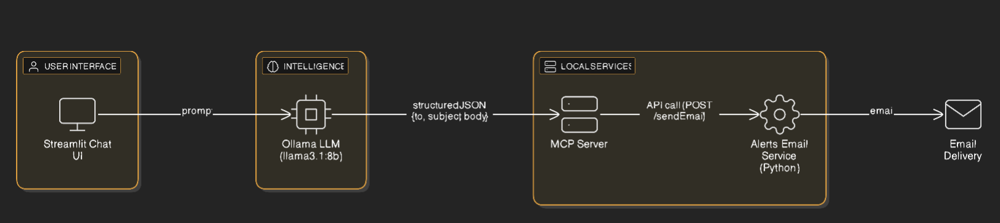
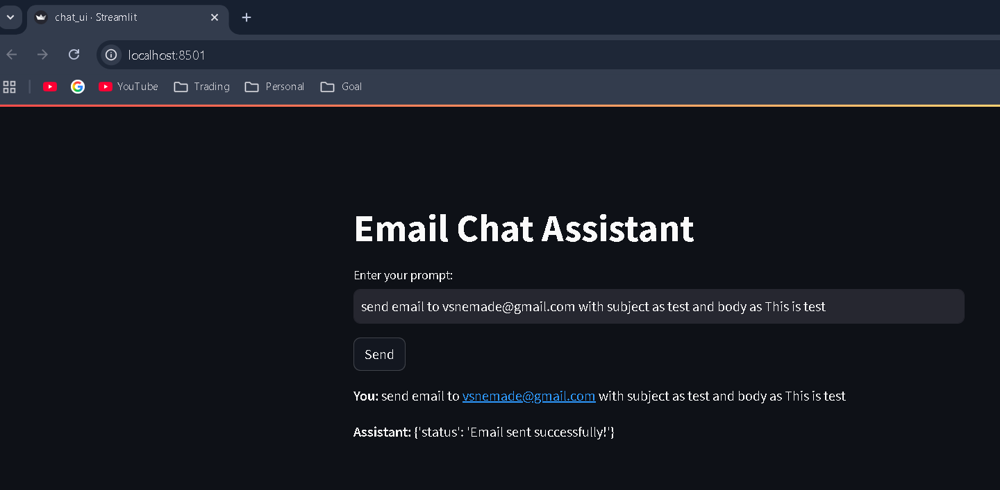

# email-bot
An AI-powered email bot that sends emails using natural language prompts via LLM, MCP, and a Python email service.

---

## 🏗️ Architecture Diagram

Below is the high-level architecture of the AI Email Bot showing the flow between the Streamlit UI, LLM (Ollama), MCP Server, and Alerts Email Service.



---


## 📧 Alerts Email Service + LLM ChatBot + MCP Server

A complete local system for sending emails using:

- **Python Alerts Email Service (REST API)**
- **Streamlit Chat UI**
- **Ollama LLM (llama3.1:8b)**
- **MCP Server (Message Control Protocol)**

---

## 📝 Overview

This system enables users to send emails using simple natural-language prompts.

Example prompt:

> **“Send an email to test@example.com saying I will be late today.”**
---
## 🖼️ Streamlit Chat UI Screenshot

Below is a screenshot of the Streamlit chat interface:



---
### 🔄 How It Works

1. The **user enters a prompt** in the Streamlit chat UI.  
2. The **Ollama LLM (llama3.1:8b)** interprets the request and generates structured email content.  
3. The **MCP Server** receives this structured output, validates it, and prepares the message.  
4. The **MCP Server calls the alerts-email-service** with the required payload (to, subject, body).  
5. The **alerts-email-service** sends the actual email via SMTP.

This forms a fully automated, local **AI Email Bot** pipeline capable of understanding natural language and sending real emails.

---
## 🔐 Environment Variables (`.env` File Required)

The **alerts-email-service** requires a `.env` file in its directory with the following variables:<br/>
GMAIL_ADDRESS=\<your email id\>@gmail.com<br/>
GMAIL_APP_PASSWORD=\<gmail application password\>

---

### Important Notes:
- You must use a **Gmail App Password**, not your normal Gmail login password.  
- App Passwords can be generated from your Google Account → Security → App Passwords.  
- Make sure less-secure access is enabled for SMTP, if required.

---


### Install Ollama
#### Windows:
Download and run the installer from [Ollama Downloads](https://ollama.com/download).

Pull the Llama model

After installing Ollama, pull the Llama 3 model locally:
```bash
ollama pull llama3.1:8b
```

---

## 🚀 How to Start the Email Bot

Follow the steps below to run the entire AI Email Bot system locally.

### **Step 1: Start the Ollama LLM Server**
Make sure Ollama is installed and running in the background.

```bash
ollama serve
```

### Step 2: Install all required python dependencies
```bash
pip install -r requirements.txt
```

### Step 3: start the alerts-email-service
```bash
python app.py
```

### Step 4: start streamlit chat ui
```bash
streamlit run chat_ui.py
```

### Step 5: start mcp server
```bash
uvicorn mcp_server:app --reload --port 8000
```

